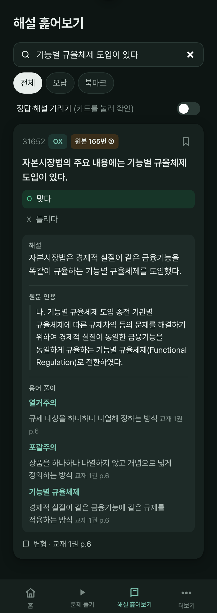
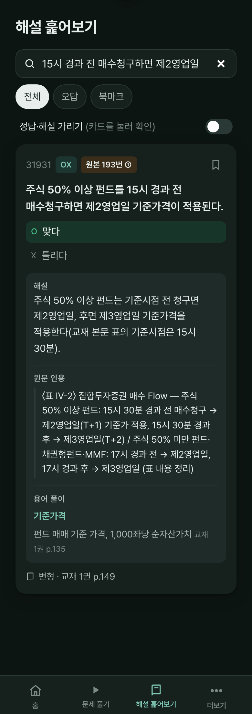
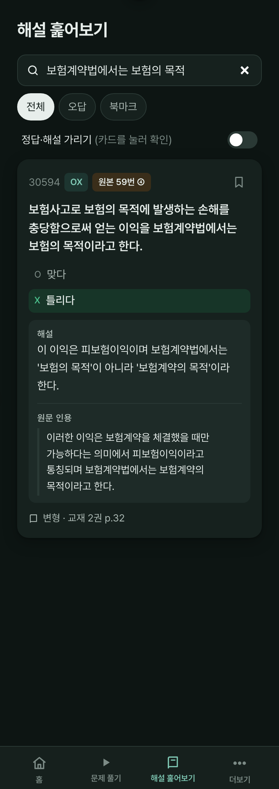
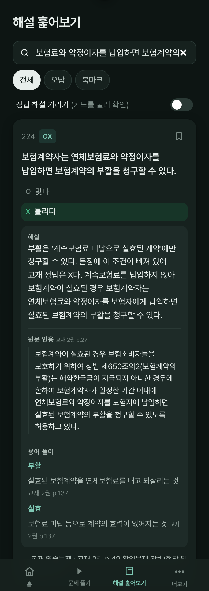
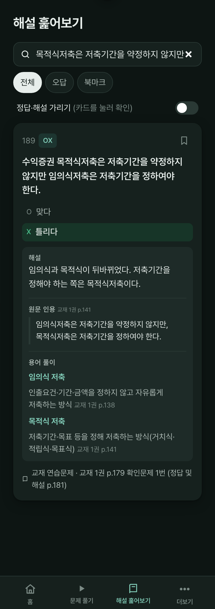

# 변형 OX 해설·원문 인용 보강 (v25)

- 변형 OX 722문항 **전부**에 교재 원문 인용과 출처 쪽수를 붙였다.
  - 원본 기출에 인용이 있고 내용이 같으면 그 인용을 재사용했다.
  - 다른 사실을 묻는 문항은 교재 본문에서 해당 문장을 직접 찾아 붙였다.
  - 교재 연습문제가 원본인 문항은 교재의 공식 "정답 및 해설" 문단을 붙였다. 출처는 `교재 N권 p.X (확인문제 k번 해설)` 형식이다.
  - 표 내용은 `(표 내용 정리)`로 표시했다.
  - 모든 인용은 교재 원문과 자동 대조했다. OCR 깨짐 2건은 눈으로 확인했다.
- "맞는 설명이다.", "교재 문장 그대로다." 같은 짧은 해설 184개를 한 줄짜리 실제 이유로 바꿨다.
- 원본 193번 묶음(기준가 적용일): 교재 본문 표(p.149)의 기준시점이 15시 30분이라는 점을 해설에 덧붙였다.

*교재 본문 인용*

*표 내용 정리 인용*

*틀린 문항 해설*

## 교재문항 보강 (v26)

- 교재 연습문제 87문항과 기출 3문항(267·272·278)에 교재 **본문** 근거 문장을 원문 인용으로 붙였다.
  - 출제원(확인문제 번호)은 그대로 두고, 인용 쪽수를 "원문 인용" 제목 옆에 따로 표시한다(`quoteSrc` 필드).
  - 본문에 근거가 없는 229·249번은 교재 공식 해설을 인용으로 붙이고, 해설은 쉬운 말로 다시 썼다.
- 왜 X인지 해설에 안 드러나던 문항에 한 줄을 보강했다(224·209·214·245·246).
  - 해설이 너무 짧던 문항도 보강했다(184·207·213).
  - 예: 224번은 부활 대상인 "실효된 계약" 조건이 빠져서 X다.
- 이제 챌린지를 뺀 모든 문항에 원문 인용이 있다.

*224번: X 이유 + 본문 인용(쪽수 표시)*

## 해설·인용 중복 정리 (v27)

- 해설과 원문 인용이 거의 같은 문장이던 67문항을 정리했다.
  - 교재 문장은 인용에만 남기고, 해설은 "왜 O/X인지" 한 줄로 다시 썼다.
  - 예: 189번 → "임의식과 목적식이 뒤바뀌었다."
- 198번은 해설이 정답 이유가 아닌 다음 내용("결산일 체크")이어서 이유로 바꿨다.

*189번: 해설은 이유, 인용은 교재 문장*
